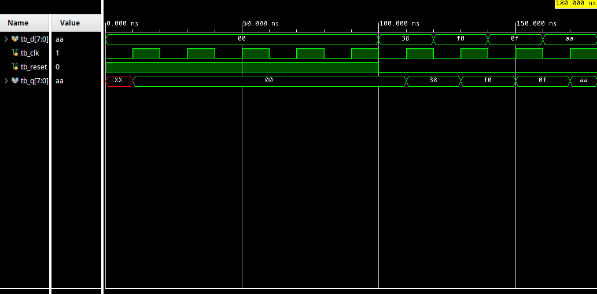
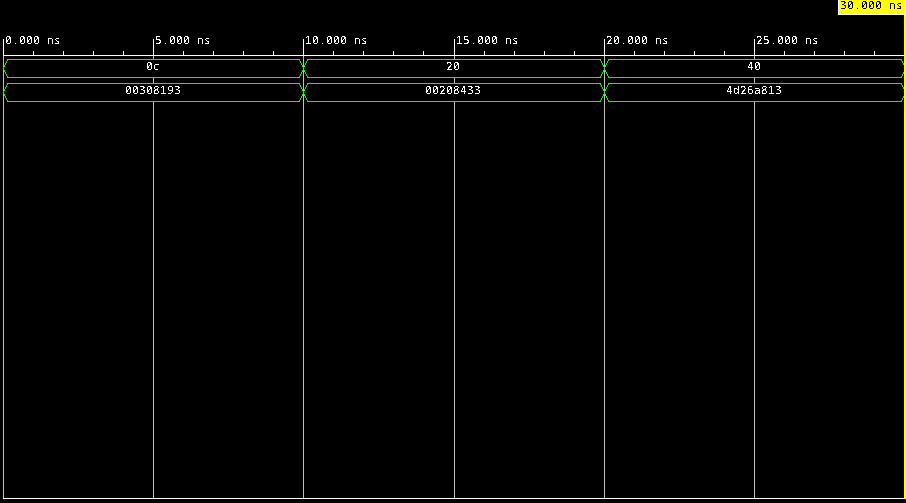
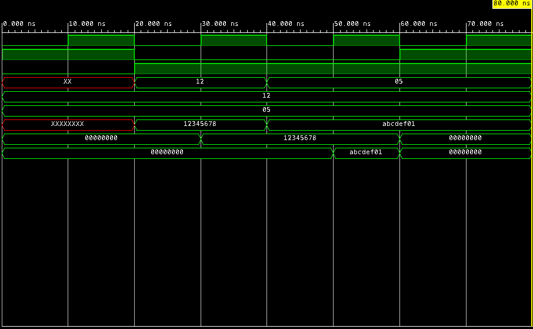

# RISC-V-Core

This project implements core building blocks for a RISC-V single-cycle processor using Verilog. It includes sequential and memory components designed to be integrated into a complete datapath.

## Components

### D Flip-Flop
- 8-bit D Flip-Flop with synchronous reset
- Holds Program Counter (PC) value
- Updates on rising clock edge
- Reset forces output to zero on next clock edge

### Instruction Memory
- 64×32 instruction memory (64 words, 32 bits each)
- Byte-addressable with word alignment
- Pre-initialized with 18 RISC-V instructions
- Combinational (no clock required)
- Uses bits [7:2] of address for word selection

### Register File
- 32×32 register array (32 registers, 32 bits each)
- Dual-port read (asynchronous)
- Single-port write (synchronous)
- Asynchronous reset clears all registers
- Write occurs on rising clock edge when enabled
- Register 0 protection (cannot be written)

## Features

- **Synchronous Reset** (FlipFlop) — Reset takes effect on rising clock edge
- **Asynchronous Reset** (RegFile) — Reset takes effect immediately
- **Word-Addressable Memory** — Instruction memory ignores lower 2 address bits
- **Dual-Port Read** — Register file supports two simultaneous reads
- **Write Enable Control** — Register file only writes when enabled

## Design Style

- Behavioral Verilog
- Clocked sequential logic for stateful components
- Combinational logic for memory reads
- Non-blocking assignments (`<=`) in sequential blocks
- Continuous assignments for asynchronous outputs

## Waveform Examples

### FlipFlop Simulation


### Instruction Memory Simulation


### Register File Simulation


## Pre-loaded Program

The instruction memory is initialized with the following RISC-V program:

| Index | Instruction | Assembly |
|-------|-------------|----------|
| 0 | `32'h00007033` | `and r0, r0, r0` |
| 1 | `32'h00100093` | `addi r1, r0, 1` |
| 2 | `32'h00200113` | `addi r2, r0, 2` |
| 3 | `32'h00308193` | `addi r3, r1, 3` |
| 4 | `32'h00408213` | `addi r4, r1, 4` |
| 5 | `32'h00510293` | `addi r5, r2, 5` |
| 6 | `32'h00610313` | `addi r6, r2, 6` |
| 7 | `32'h00718393` | `addi r7, r3, 7` |
| 8 | `32'h00208433` | `add r8, r1, r2` |
| 9 | `32'h404404b3` | `sub r9, r8, r4` |
| 10 | `32'h00317533` | `and r10, r2, r3` |
| 11 | `32'h0041e5b3` | `or r11, r3, r4` |
| 12 | `32'h0041a633` | `slt r12, r3, r4` |
| 13 | `32'h007346b3` | `nor r13, r6, r7` |
| 14 | `32'h4d34f713` | `andi r14, r9, 0x4D3` |
| 15 | `32'h8d35e793` | `ori r15, r11, 0x8D3` |
| 16 | `32'h4d26a813` | `slti r16, r13, 0x4D2` |
| 17 | `32'h4d244893` | `nori r17, r8, 0x4D2` |

## Files

### Design Sources
- `flip_flop.v` — 8-bit D Flip-Flop with synchronous reset
- `inst_mem.v` — 64×32 instruction memory
- `reg_file.v` — 32×32 register file with dual-port read

### Testbenches
- `flip_flop_tb.v` — FlipFlop testbench with clock generation
- `inst_mem_tb.v` — InstMem testbench for word-aligned addressing
- `reg_file_tb.v` — RegFile testbench for write/read verification

## Simulation

Run using Vivado or any Verilog simulator supporting behavioral simulation.

### Clock Generation Pattern
```verilog
always #10 clk = ~clk;  // 20 ns period (50 MHz)
```

### Key Test Scenarios
- **FlipFlop**: Reset behavior, edge-triggered updates, data retention
- **InstMem**: Word-aligned addressing, combinational read
- **RegFile**: Asynchronous reset, synchronous write, dual-port read

## Integration

These modules are designed to integrate into a complete RISC-V single-cycle datapath alongside:
- ALU (Arithmetic Logic Unit)
- Adder (PC increment)
- MUX (data path selection)
- DataMem (data memory)
- ImmGen (immediate generator)
- Control Unit (instruction decoding)